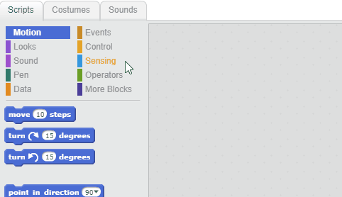
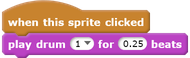

## Making a drum

Now you will add code to your drum so that the drum makes a sound when it's clicked.

You can find the code blocks in the Scripts tab, and they are all colour-coded!

--- task ---
Click on the drum sprite, and then drag these two blocks into the code area on the right:

--- no-print ---

--- /no-print ---

--- print-only ---

--- /print-only ---

Make sure that the blocks are connected together (like LEGO bricks).

--- /task ---

--- task ---
Click on the drum to try out your new instrument!
--- /task ---
