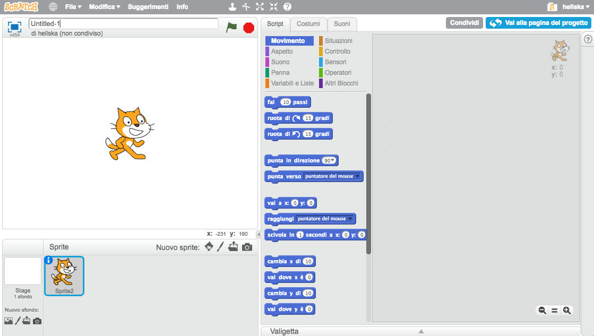
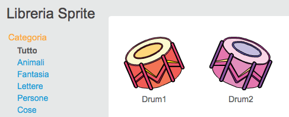
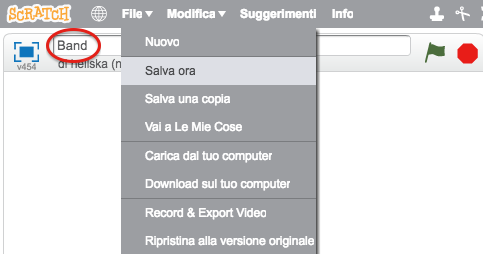

## Sprites

Prima di cominciare a programmare devi aggiungere un 'oggetto', in Scratch questi 'oggetti' si chiamano __sprites__.

+ Prima di tutto apri l'editor di Scratch. Lo trovi online all'indirizzo: <a href="http://jumpto.cc/scratch-new" target="_blank">jumpto.cc/scratch-new</a>. Si presenta così:

	

+ Lo sprite del gatto che vedi è la mascotte di Scratch. Buttiamolo via premendo col tasto destro del mouse sullo sprite per selezionare l'opzione 'cancella'.

	

+ Poi fai click col mouse su 'scegli uno sprite dalla libreria' per aprire la lista con tutti gli sprite di Scratch.

	

+ Scorri verso il basso fino a che non trovi lo sprite di un tamburo. Seleziona uno dei due sprite e per aggiungerlo al progetto premi il tasto 'OK' in basso a destra.

	

+ Premi l'icona 'espandi' e poi fai click varie volte sul tamburo per rimpicciolirlo.

	

Dai un nome al tuo programma, scrivendo nella casella di testo nell'angolo in alto a sinistra.

Per salvare il progetto puoi anche selezionare la voce 'Salva ora' dal menu 'File'.

(Se invece non hai un account Scratch, puoi comunque salvare una copia del tuo progetto selezionando 'Download sul tuo computer').
